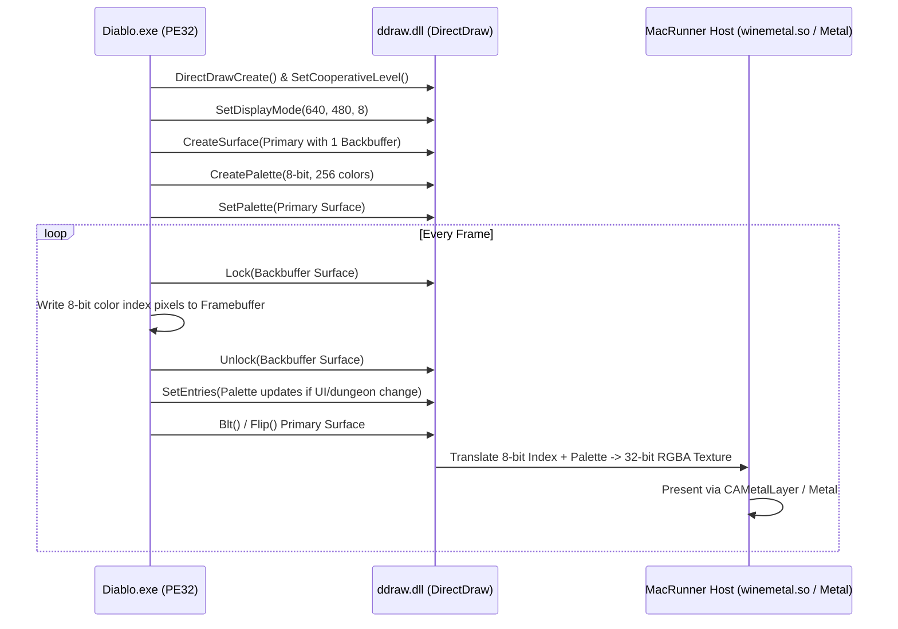

# Lane F Prep Doc: Diablo 1 DirectDraw Oracle Compatibility Design

**Date:** 2026-06-06  
**Path:** [GEMINI-lanef-diablo-ddraw.md](file:///Users/timurtoby/Documents/MacRunner/Main/MacRunner/reports/research/GEMINI-lanef-diablo-ddraw.md)  
**Target Application:** Diablo 1 / Hellfire (`diablo_i386_native`, `diablo_i386_dx`, `diablo_i386_hellfire`)  
**Graphics API:** DirectDraw (`ddraw.dll` - 2D, 8-bit palettized)  
**Execution Lane:** PE32/WOW64 (32-bit) CPU-interpreter/JIT  

---

> [!IMPORTANT]
> Diablo 1 uses ancient 8-bit palettized DirectDraw. Palettized textures and screens are not natively supported by Apple Silicon GPUs or the Metal shading language. To make Diablo 1 work seamlessly, we must build a DirectDraw compat oracle that intercepts palette updates and framebuffer locks, translating them to a 32-bit RGBA Metal presentation pipeline.

---

## 1. DirectDraw Technical Landscape for Diablo 1

Diablo 1's rendering architecture is built on the initial 1996 DirectDraw interfaces. It performs the following sequence:



### The 8-bit Palettized Bottleneck
Modern graphics APIs (including Apple Metal and Vulkan) do not have a native format for 8-bit indexed colors where pixels are pointers to a 256-entry RGB table.
- **Surface Lock:** Diablo requests a pointer to the raw VRAM surface via `IDirectDrawSurface::Lock`. It expects a pitch of `640` bytes and writes a single byte per pixel.
- **Palette Churn:** The game frequently alters palette entries (`IDirectDrawPalette::SetEntries`) to animate lighting, select menus, or render fade-in/fade-out transitions.

---

## 2. The DirectDraw Palette Oracle Design

To bridge the guest PE32 8-bit space and the host macOS 32-bit Metal space, we design the **MacRunner DirectDraw Palette Oracle**:

### A. Memory-Mapped Guest Framebuffer
Instead of allocating a real GPU surface for the guest lock, our `ddraw.dll` wrapper allocates a host-side staging buffer in system memory:
- **Size:** `640 * 480 = 307,200` bytes (single byte array).
- **Behavior:** When the game calls `Lock()`, we return the pointer to this staging buffer. The game writes its pixels here.

### B. Palette Shadow State
We maintain a shadow structure of the active palette:
```c
struct ShadowPalette {
    uint32_t entries[256]; // 32-bit RGBA cached values
    uint64_t version;      // Incremented on every SetEntries() call
};
```

### C. The Translation Oracle (CPU vs GPU)
We evaluate two modes for translating 8-bit index arrays to 32-bit RGBA frames:

| Metric | CPU Conversion Mode | GPU Shader Conversion Mode (Recommended) |
|---|---|---|
| **Mechanism** | A nested loop on the CPU reads 8-bit bytes, looks up RGB values in the shadow palette, and writes to a 32-bit RGBA CPU buffer, which is uploaded to Metal. | The 8-bit index buffer is uploaded to a 1D `R8_UInt` texture, the palette is uploaded to a 1D `RGBA8` texture, and a Metal compute shader resolves the final pixels. |
| **Metal Overhead** | Simple `replaceRegion` upload of 1.2 MB per frame. | Upload of two small textures (300 KB index texture + 1 KB palette texture) per frame. |
| **CPU Overhead** | High (640x480 loop every frame on Rosetta/interpreter thread). | Extremely Low (almost instant on Apple Silicon). |
| **Palette Animation** | Trivial (changes resolved on CPU immediately). | Handled by binding the updated palette texture. |
| **Recommendation** | Prototype only. | **Production Target** for best frame pacing. |

---

## 3. Integration with the JIT/SEH Layer

Diablo 1 uses structured exception handling (SEH) extensively during thread execution and network startup. 
- The DirectDraw helper must be loaded inside the WOW64 context.
- Once Lane PE32 successfully executes `BTCpuSimulate`, our wrapper `ddraw.dll` must hook into `winemetal.so` to acquire the window handle (`HWND`) created by the game.

### Palette Oracle API Contract
We define the following internal boundary between the DirectDraw wrapper and the graphics presenter:

```c
// winemetal_ddraw_bridge.h

typedef struct {
    uint32_t width;
    uint32_t height;
    uint8_t *index_pixels;
    uint32_t *palette_rgba;
    uint64_t palette_version;
} DDrawFrameDescriptor;

// Exported by winemetal.so to consume 2D frames
void MacRunner_PresentDDrawFrame(HWND hwnd, DDrawFrameDescriptor *frame);
```

---

## 4. Oracle Validation Checkpoint

To verify the DDraw implementation without running the full game loop (reducing test time):

1. **Synthetic Fixture:** Create a simple 32-bit test app `ddraw_smoke_i386.exe` that locks a surface, writes a checkerboard pattern of indices `0` and `1`, changes the palette periodically, and presents.
2. **Oracle Comparison:** Assert that the host window outputs the correct colors.
3. **Fade Validation:** Test that writing a series of dark palette transitions yields smooth fading frames on macOS.
