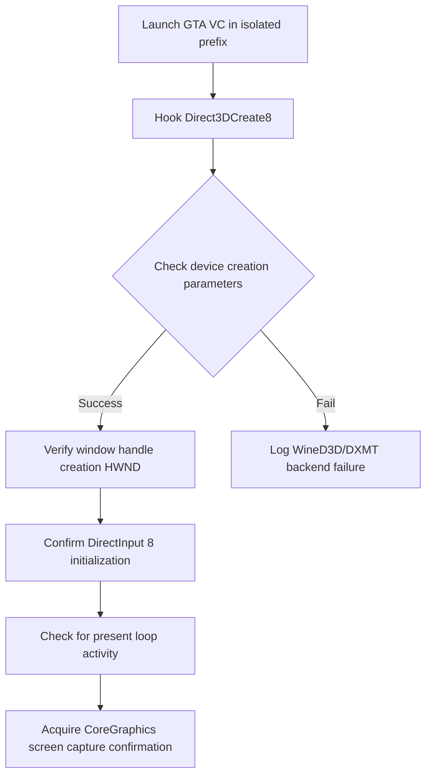

# Lane G Prep Doc: GTA VC D3D8 Smoke Plan & Installer/FreeArc Checklist

**Date:** 2026-06-06  
**Path:** [GEMINI-laneg-gtavc-d3d8-installer.md](file:///Users/timurtoby/Documents/MacRunner/Main/MacRunner/reports/research/GEMINI-laneg-gtavc-d3d8-installer.md)  
**Target Application:** GTA Vice City classic (PE32 i386) & Repack Installers  
**Technologies:** Direct3D 8 (`d3d8.dll`), Inno Setup, FreeArc decompression (`unarc.dll`/`arc.exe`)  
**Execution Lane:** PE32/WOW64 (32-bit) CPU-interpreter/JIT  

---

## Part 1: GTA Vice City Direct3D 8 Smoke Plan

GTA Vice City classic runs on the RenderWare engine, targeting Direct3D 8 for graphics, DirectInput 8 for keyboard/mouse, and DirectSound for audio.

### 1. Direct3D 8 Integration Model

Since DXMT (our graphics engine) is a D3D11-to-Metal translator, we must choose a graphics bridge path:

```text
GTA Vice City (PE32)
   |
   +--> [d3d8.dll] Wrapper (Translates D3D8 calls to D3D9)
           |
           +--> [d3d9.dll] Frontend (Translates D3D9 to D3D11 / DXMT Core)
                   |
                   +--> [dxgi.dll/d3d11.dll] DXMT Core (winemetal.so)
                           |
                           +--> CAMetalLayer / Metal (Apple Silicon GPU)
```

> [!TIP]
> Emulating D3D8 directly over D3D9 is the standard industry approach (proven by `dxvk-upstream`'s `d3d8` wrapper). It avoids duplicating rendering logic for old fixed-function draw states.

### 2. Smoke Plan Verification Steps

To validate GTA Vice City graphics without full game execution:



1. **Standalone D3D8 Smoke:** Build a 32-bit `d3d8_clear_smoke.exe` that calls `Direct3DCreate8`, setups windowed device, clears screen to pink, and presents. Verify the pink window renders on macOS.
2. **Device Parameter Check:** Confirm the device supports FVF (Flexible Vertex Format) conversion to internal Metal input layouts.
3. **Window Capture Verification:** Verify that the `GTA: Vice City` window is successfully composited by the macOS window manager, using the `tools/triage/analyze_window_gate.py` tool.

---

## Part 2: Installer & FreeArc Decompression Checklist

GOG and repack installers (often using Inno Setup or custom packaging tools) rely on secondary tools like **FreeArc** (`unarc.dll` / `arc.exe`) for decompression. These installers stress-test memory models and asynchronous system operations.

### 1. The WOW64 Memory & IPC Handoff

When a 32-bit installer extracts game files:

```text
Installer (Inno Setup PE32) 
   --> Spawns helper (arc.exe / unarc.dll)
   --> Communicates via IPC (Pipes)
   --> Performs high-churn file writes
```

### 2. The 32-Bit Installer Checklist

To support installers like GOG or FreeArc repacks, the WOW64/xtajit and Win32 layers must satisfy the following checklist:

- [ ] **LAA (Large Address Aware) Support:** 
  - Installers and decompressors routinely require up to 3 GB of virtual memory.
  - The WOW64 translation layer must allow memory mapping up to the `0xC0000000` (3GB) boundary instead of capping at 2GB.
- [ ] **Anonymous Pipes and IPC:**
  - `CreatePipe` must be fully implemented to route decompressor progress (`arc.exe` stdout) back to the installer GUI.
  - `PeekNamedPipe` and `ReadFile` on asynchronous pipe handles must not block the installer thread.
- [ ] **Process Synchronization:**
  - `CreateProcessW` must successfully spawn helper processes (`arc.exe`) in the correct architecture (i.e. x86_64 helper on macOS host or i386 WOW64 guest).
  - `WaitForSingleObject` and `GetExitCodeProcess` must accurately track when decompression finishes.
- [ ] **System Directory Redirection:**
  - 32-bit helpers look for `unarc.dll` in `C:\windows\system32`.
  - WOW64 file system redirection must route these searches to `C:\windows\syswow64` transparently.
- [ ] **File Write Performance:**
  - Decompressing 2 GB of game data performs hundreds of thousands of small `WriteFile` calls.
  - Ensure disk caching/flushing does not cause bottlenecks in our file I/O layer.
