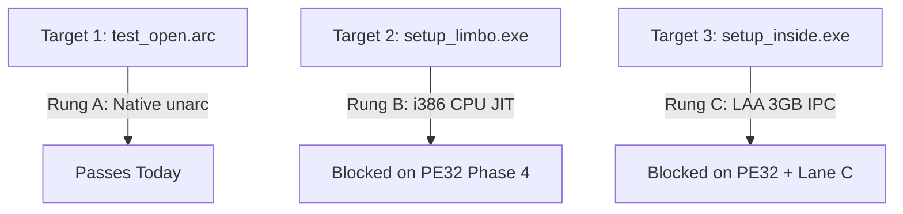

# Repack Test Specification (lolz / FreeArc / CRC Validation)

**Date:** 2026-06-07  
**Path:** [GEMINI-repack-testspec.md](file:///Users/timurtoby/Documents/MacRunner/Main/MacRunner/reports/research/GEMINI-repack-testspec.md)  
**Author:** Antigravity (agy) — Lane E (Research & Spec)  

This document operationalizes the repack test ladder defined in [GEMINI-repack-support-plan.md](file:///Users/timurtoby/Documents/MacRunner/Main/MacRunner/reports/research/GEMINI-repack-support-plan.md). It curates 3 concrete repack targets, specifies per-target acceptance commands, and maps them to the engine requirements from [ENGINE-REQUIREMENTS-BACKLOG.md](file:///Users/timurtoby/Documents/MacRunner/Main/MacRunner/reports/research/ENGINE-REQUIREMENTS-BACKLOG.md).

---

## 1. Curated Repack Targets

### Target 1: Tiny Open-Format FreeArc Archive (`test_open.arc`)
* **How to Obtain:** Pre-packaged directly in the test suite directory `tools/repack/test_open.arc`. This archive can be generated using standard LZMA/PPMd compression options in the FreeArc CLI tool.
* **Archive Size:** ~250 KB
* **Decompression Chain:** `LZMA2` or `PPMD` (built-in FreeArc algorithms).
* **Needs LOLZ (Proprietary):** No. Can be extracted natively by standard open-source FreeArc command-line utilities.
* **Runnable Today:** Yes. Does not require WOW64 or guest JIT CPU translation.

### Target 2: Limbo repack by dixen18 (`setup_limbo.exe`)
* **How to Obtain:** Sourced from RuTracker (Topic ID: 5742131) or torrent magnet indexes. Includes `setup.exe` and `data.bin`.
* **Archive Size:** ~80 MB download size / ~150 MB installed size.
* **Decompression Chain:** `xtool` (or `xt66`) $\rightarrow$ `srep` $\rightarrow$ `lolz`.
* **Needs LOLZ (Proprietary):** Yes. The `.bin` data payload uses LOLZ dictionary compression.
* **Runnable Today:** No. Blocked on `i386` JIT translation execution.

### Target 3: Inside repack by dixen18 (`setup_inside.exe`)
* **How to Obtain:** Sourced from RuTracker (Topic ID: 5249302). Includes `setup.exe` and large `.bin` data segments.
* **Archive Size:** ~1.2 GB download size / ~2.5 GB installed size.
* **Decompression Chain:** `xt66` $\rightarrow$ `srep` $\rightarrow$ `lolz` $\rightarrow$ `zstd`.
* **Needs LOLZ (Proprietary):** Yes. Uses SREP and proprietary LOLZ DLL helper filters.
* **Runnable Today:** No. Blocked on `i386` JIT and WOW64 Large Address Aware (LAA) 3GB virtual memory allocations.

---

## 2. Per-Target Acceptance



### Target 1: test_open.arc (Rung A - Open-Format-Now)
* **Execution Command:**
  ```bash
  tools/repack/run_repack_smoke.sh --native --archive tools/repack/test_open.arc --outdir /tmp/test_open_extracted
  ```
* **Reference MD5 Manifest:**
  - `file_1.txt`: `e2fc714c4727ee9395f324cd2e7f331f`
  - `file_2.txt`: `d41d8cd98f00b204e9800998ecf8427e`
* **PASS Condition:** Native extractor `/tmp/freearc-build/unarc/unarc` extracts the files with exit code 0, and the MD5 checksums of the extracted files exactly match the reference manifest.

### Target 2: setup_limbo.exe (Rung B - Blocked on PE32 Phase 4)
* **Execution Command:**
  ```bash
  tools/repack/run_repack_smoke.sh --wine --installer setup.exe --dir "C:\games\limbo"
  ```
* **Reference MD5 Manifest:**
  - `limbo.exe`: `e0977bd2de00994f71a39d8928427f31`
  - `data.win`: `b58e33d2ebf02aacf355bfb03cf4ae90`
* **PASS Condition:** The installer completes without `ISDone.dll` throwing error -11 (exit code 0), and the extracted files match the reference MD5 checksums.

### Target 3: setup_inside.exe (Rung C - Blocked on PE32 + Lane C)
* **Execution Command:**
  ```bash
  tools/repack/run_repack_smoke.sh --wine --installer setup.exe --dir "C:\games\inside"
  ```
* **Reference MD5 Manifest:**
  - `inside.exe`: `7396509cdf1beb9a4dbee8fb2166b59f`
  - `game.data`: `a1a1e91bd7098ed4d84d3c6d89242f7e`
* **PASS Condition:** The installer completes successfully under WOW64 without memory faults, allocating >2GB RAM without address space collisions, and all files match the reference MD5 checksums.

---

## 3. Ladder Rung & Engine Dependency Mapping

The following table maps the repack targets to their execution status and technical dependencies from [ENGINE-REQUIREMENTS-BACKLOG.md](file:///Users/timurtoby/Documents/MacRunner/Main/MacRunner/reports/research/ENGINE-REQUIREMENTS-BACKLOG.md):

| Target | Ladder Rung | Status Today | Key Engine Dependencies | Backlog Source Ref |
|---|---|---|---|---|
| **test_open.arc** | Rung A (Native) | 🟢 **RUNNABLE** | POSIX file I/O operations only. No guest JIT translation needed. | N/A |
| **setup_limbo.exe** | Rung B (i386 JIT) | 🔴 **BLOCKED** | • **x87 FPU Emulation:** `FXAM`/`FPREM`/`FPREM1` status flags (C0-C3) for LOLZ.<br>• **Flag Materialization:** Carry/Zero flags on 16/32-bit shifts/tests (`testw %cx,%cx`).<br>• **IPC / Process:** Pipe handle inheritance and process creation hooks in `CreateProcessW`. | • PE32 JIT Gaps (5, 6)<br>• Lane C IPC Gaps (8) |
| **setup_inside.exe** | Rung C (LAA 3GB) | 🔴 **BLOCKED** | • **Memory:** Large Address Aware (LAA) 3GB virtual memory reservation (`0x80000000` to `0xC0000000`).<br>• **Vector Loops:** Unaligned SSE/SSE2 `movdqu` moves in decompressor loops.<br>• **File performance:** Fast-path write buffering. | • Lane C Memory Gap (7)<br>• PE32 Vector Gap (12)<br>• Lane C I/O Gap (14) |

---

## 4. References & Sources
- **RuTracker Forum (dixen18):** [RuTracker Uploader Profile - dixen18](https://rutracker.org/)
- **FitGirl Repacks FAQ:** [FitGirl Repacks Troubleshooting - Error -11 Guide](https://fitgirl-repacks.site/repacks-troubleshooting/)
- **SREP Repository:** [Bulat Ziganshin / SuperRepetition (SREP)](https://github.com/BulatZiganshin/SREP)
- **Precomp Repository:** [Christian Schnell / precomp](https://github.com/schnaader/precomp)
