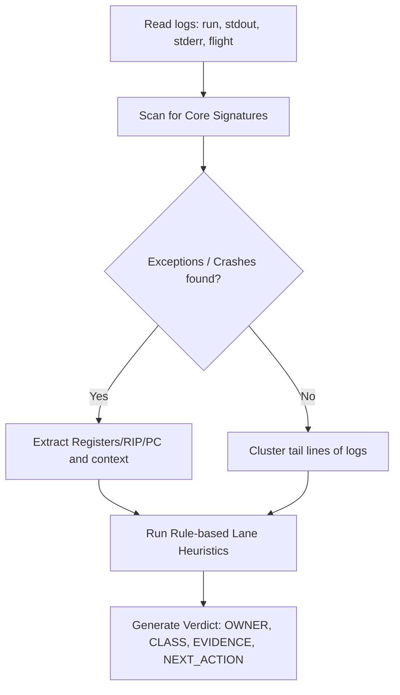

# Triage System: Generic Fallback Analyzer Design

**Date:** 2026-06-06  
**Path:** [GEMINI-triage-fallback.md](file:///Users/timurtoby/Documents/MacRunner/Main/MacRunner/reports/research/GEMINI-triage-fallback.md)  
**Target Module:** [classify_run.py](file:///Users/timurtoby/Documents/MacRunner/Main/MacRunner/tools/triage/classify_run.py) / new analyzer `analyze_generic_fallback.py`  

---

## 1. Problem Statement

Currently, the MacRunner triage system employs a pipeline of specialized analyzers (e.g., `analyze_window_gate.py`, `analyze_pe32_wow64_handoff.py`). If a run fails due to a novel bug or unrecognized exception, all specialized analyzers output `PASS` or low-confidence `UNKNOWN`. The run is classified as `UNKNOWN` with `NO_ANALYZER_RESULTS` or a bare verdict, offering no actionable insight to the developer.

To solve this, we design the **Generic Fallback Analyzer** (`analyze_generic_fallback.py`). This analyzer triggers when specific domain indicators do not match, clustering log patterns and predicting the responsible engineering lane based on crash signatures.

---

## 2. Architecture & Pipeline

The generic analyzer works by scanning log buffers for common failure patterns and mapping them to owners.



---

## 3. Diagnostic & Routing Rules

The fallback analyzer uses the following classification matrix to route unhandled failures:

| Exception Signature | Pattern / Keywords | Predicted Owner | Triage Class | Rationale |
|---|---|---|---|---|
| **Access Violation** | `c0000005`, `PAGE_FAULT`, `segmentation fault`, `invalid memory address` | **Lane C** (Loader/VM) | `GENERIC_ACCESS_VIOLATION` | Memory protection or pointer dereferencing issue in VirtualAlloc / NtProtect. |
| **Illegal Instruction** | `c000001d`, `illegal instruction`, `unsupported opcode`, `UD2` | **Lane B** (ISA) | `GENERIC_ILLEGAL_INSTRUCTION` | HyperBridge decoder, lifter, or interpreter is missing CPU instruction support. |
| **Assertion Failure** | `Assertion failed`, `assert`, `failed check` | **Lane A** (JIT/Core) | `GENERIC_ASSERTION_FAILED` | Internal engine state invariant violation. |
| **Graphics Crash** | `Vulkan`, `Metal`, `WineD3D`, `GL_INVALID`, `MTLDevice` | **Lane D** (Graphics) | `GENERIC_GRAPHICS_FAULT` | Graphics API translation or pipeline issue. |
| **WOW64 Failure** | `wow64`, `xtajit`, `btcpu` | **Lane PE32** (32-bit WOW64) | `GENERIC_WOW64_FAULT` | WOW64 subsystem initialization or thunking issue. |

---

## 4. Proposed Implementation (`analyze_generic_fallback.py`)

Here is the design specification for the new analyzer script to be placed in `tools/triage/analyze_generic_fallback.py`:

```python
# tools/triage/analyze_generic_fallback.py
import sys
import os
import re

# Add parent dir to path if needed...
sys.path.append(os.path.dirname(os.path.abspath(__file__)))
from triage_common import find_logs

CRASH_PATTERNS = [
    (r"c0000005", "Lane C", "ACCESS_VIOLATION", "Access Violation (c0000005) detected."),
    (r"c000001d", "Lane B", "ILLEGAL_INSTRUCTION", "Illegal Instruction (c000001d) detected."),
    (r"assertion failed", "Lane A", "ASSERTION_FAILED", "Engine assertion failed."),
    (r"vulkan|mtldevice|wined3d|metal", "Lane D", "GRAPHICS_CRASH", "Graphics subsystem issue detected."),
    (r"wow64|xtajit|btcpu", "Lane PE32", "WOW64_FAULT", "WOW64 subsystem issue detected.")
]

def analyze_logs(run_dir):
    logs = find_logs(run_dir)
    log_content = ""
    for k in ["run", "stderr", "stdout"]:
        p = logs.get(k)
        if p and os.path.exists(p):
            with open(p, "r", errors="ignore") as f:
                log_content += f.read()

    # Search for known crash signatures
    for pattern, owner, klass, desc in CRASH_PATTERNS:
        match = re.search(pattern, log_content, re.IGNORECASE)
        if match:
            # Extract context lines
            context_lines = []
            lines = log_content.splitlines()
            for idx, line in enumerate(lines):
                if re.search(pattern, line, re.IGNORECASE):
                    start = max(0, idx - 5)
                    end = min(len(lines), idx + 10)
                    context_lines.extend(lines[start:end])
                    break
            
            print("VERDICT: BLOCKED")
            print(f"OWNER: {owner}")
            print(f"CLASS: GENERIC_{klass}")
            print("CONFIDENCE: 0.70")
            print("EVIDENCE:")
            for c_line in context_lines[:15]:
                print(f"  {c_line}")
            print("NEXT_ACTION:")
            print(f"  Investigate fallback crash: {desc} Check the extracted context lines.")
            return

    # Default fallback if absolutely no signature matches
    tail_lines = log_content.splitlines()[-20:]
    print("VERDICT: UNKNOWN")
    print("OWNER: Coordinator")
    print("CLASS: GENERIC_UNKNOWN_FAILURE")
    print("CONFIDENCE: 0.50")
    print("EVIDENCE:")
    for t_line in tail_lines:
        print(f"  {t_line}")
    print("NEXT_ACTION:")
    print("  Read the last log lines of the run and determine the new crash signature.")

if __name__ == "__main__":
    analyze_logs(sys.argv[1])
```

---

## 5. Integration into `classify_run.py`

To activate this, we would append `"analyze_generic_fallback.py"` to the `ANALYZERS` list in [classify_run.py](file:///Users/timurtoby/Documents/MacRunner/Main/MacRunner/tools/triage/classify_run.py#L93-L100).
- This ensures that if all specialized analyzers yield `PASS`, the fallback analyzer's `BLOCKED` or detailed `UNKNOWN` verdict will override and provide clear owners and actions.
